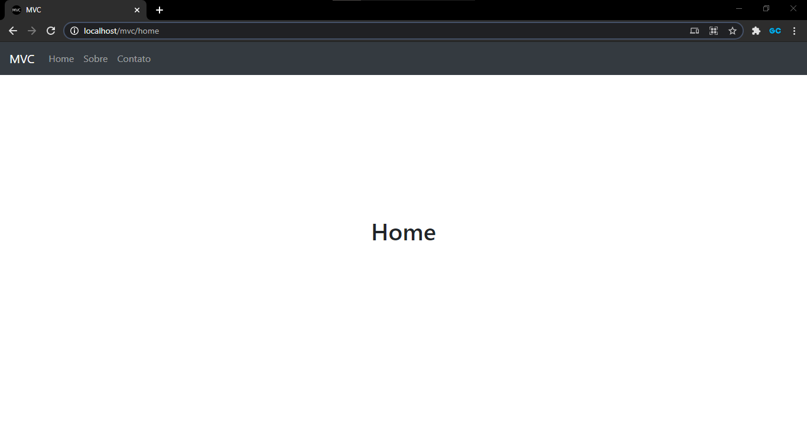

<p align="center">
	</img>
</p>

<p align="center">
	<a href="https://github.com/gcairesdev/mvc">
		</img>
	</a>
	<a href="https://github.com/gcairesdev/mvc/blob/master/LICENSE.md">
		</img>
	</a>
	<a href="https://github.com/gcairesdev/mvc">
		</img>
	</a>
</p>

# Índice

* [Sobre o projeto](#mvc)
	* [Feito com](#feito-com)
	* [Objetivo](#objetivo)
* [Iniciando](#iniciando)
	* [Pré requisitos](#pré-requisitos)
	* [Instalação](#instalação)
	* [Controllers](#controllers)
	* [Views](#views)
* [Contribuindo](#contribuindo)
* [Autor](#autor)
* [Licença](#licença)

## MVC
> Estrutura MVC para PHP com bootstrap, jquery e URL amigável

Template de uma estrutura Model, View, Controller em PHP. Está incluso URL
amigável, Bootstrap 4, jQuery e PopperJs.

<p align="center">
	</img>
</p>

### Feito com
* [PHP](https://php.net/)
* [Bootstrap 4](https://getbootstrap.com/)
* [jQuery](https://jquery.com/)
* [PopperJs](https://popper.js.org/)

### Objetivo

O objetivo é facilitar a criação de projetos PHP utilizando uma estrutura
simples, porém completa. 

## Iniciando

Para iniciar, veja os pré requisitos do projeto.

### Pré requisitos
* [PHP 5.6+](https://php.net/)
* [Apache](https://www.apache.org/)

### Instalação

Instalação padrão de um projeto PHP.

Clone o repositório em um diretório que possua virtual host:

```git
git clone https://github.com/gcairesdev/mvc
```

Mude o PATH, caso altere o nome da pasta:

```
NOME_DA_PASTA
│
└───Application.php
```

```php
<?php
	
	define('INCLUDE_PATH','http://localhost/NOME_DA_PASTA/');
	define('INCLUDE_PATH_FULL','http://localhost/NOME_DA_PASTA/Views/pages/');
```

Com o serviço do Apache ativo, acesse a URL:

```
http://localhost/mvc
```

### Controllers

Crie um Controller:

```
mvc
│
└───Controllers
    │
	└───NovoController.php
```

Adicione o código:

```php
<?php	

	class NovoController extends Controller
	{

		public function __construct()
		{
			$this->view = new MainView('nome-do-arquivo-da-view');
		}

		public function index()
		{
			$this->view->render(
				array(
					'title' => 'Exemplo'
				)
			);
		}
	}

?>
```

### Views

Crie uma View:

```
mvc
│
└───Views
    │
	└───pages
		│
		└───nome-do-arquivo-da-view.php
```

Adicione qualquer conteúdo:

```html
<h1>Hello World!</h1>
```

Adicione ao menu:

```
mvc
│
└───Views
    │
	└───MainView.php
```

```php
<?php

	class MainView
	{

		private $fileName;
		private $header;
		private $footer;

		const title = 'MVC';
		public $menuItems = array('Home', 'Sobre', 'Contato', 'Novo');
```

## Autor

|                |                  |          |            |         |
|----------------|------------------|----------|------------|---------|
| ![][githubImg] | Guilherme Caires | [Github] | [Linkedin] | [Email] |

## Contribuindo 

Confira a página [CONTRIBUTING](./CONTRIBUTING.md) para ver os melhores locais para arquivar problemas, iniciar discussões e começar a contribuir.

## Licença

Lançado em 2020.
Este projeto está sob a [Licença MIT](./LICENSE.md).

---

<p align="center">
    Feito com :heart: por 
	<a href="https://github.com/gcairesdev">Guilherme Caires</a>
</p>

<!-- Markdown link & img dfn's -->
[Github]: https://github.com/gcairesdev
[GithubImg]: https://avatars.githubusercontent.com/u/54117888?s=100
[Linkedin]: https://linkedin.com/in/guilherme-caires/
[Email]: contatogcaires@gmail.com
